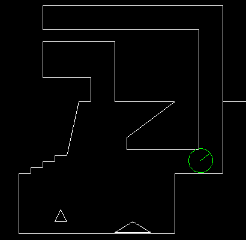

# collide2d

Author: Sebastien Alaiwan

A tiny standalone 2D collision detection and response test app

To run, simply launch:
```
./run.sh
```

Or you can compile it yourself using the following command:
```
g++ main.cpp collision.cpp `sdl2-config --cflags --libs` -o collide2d
```

<p align="center"></p>
